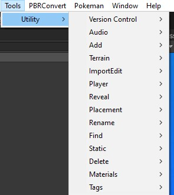
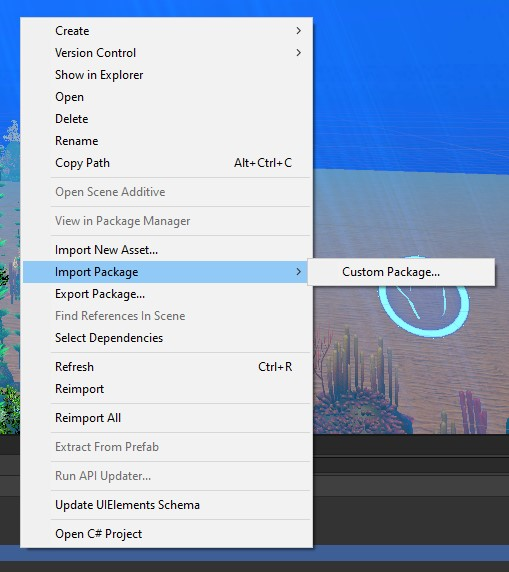

## Quick Start

To access the Tools, click Tools > Utility for the tools, yep.

## Download & Install

1. To download, go to the Releases page of this Github Repo.

2. Right click your Project area in Unity, then go to Import Package > Custom Package

3. Find the downloaded file from this repo, and install it.

4. Remove any scripts that throw Errors if you don't want to install the dependencies listed below.

   

## Required Unity Asset Store Assets

There are a few Assets from the  Unity Asset Store that you need to download/purchase If you plan to use this Utility Pack without deleting or finding any errors.

- Command Terminal - Free
  - https://assetstore.unity.com/packages/tools/gui/command-terminal-123344
  - Multiple scripts reference this, Might as well install it. It's free and small.
- MapMagic 2 - Free
  - https://assetstore.unity.com/packages/tools/terrain/mapmagic-2-165180
  - UtilitySetMapMagicTerrainSettings.cs
- CTS - Complete Terrain Shader - $57
  - https://assetstore.unity.com/packages/tools/terrain/cts-complete-terrain-shader-91938
  - UtilitySetMapMagicTerrainSettings.cs

